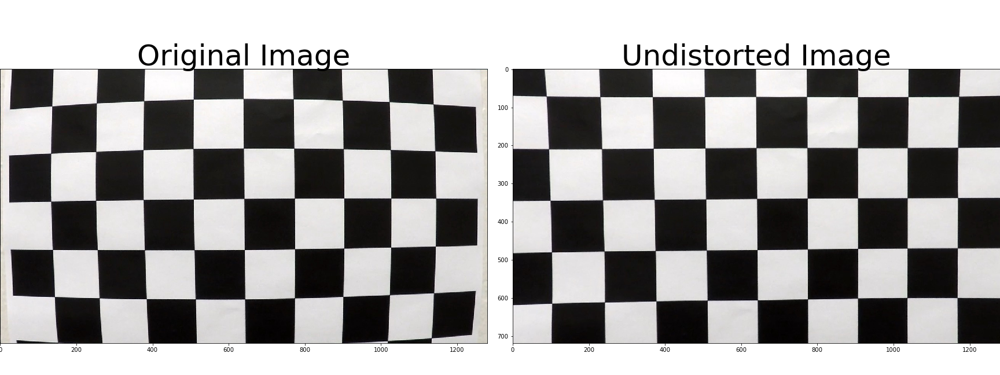

## Writeup for P4 Advanced Lane Finding

The project uses video and image analytical techniques to project find the lane where the car is driving, and to project that lane onto the camera image.

The goals / steps of this project are the following:  

1. Compute the camera calibration matrix and distortion coefficients given a set of chessboard images. 
1. Apply a distortion correction to raw images.
1. Use color transforms, gradients, etc., to create a thresholded binary image.
1. Apply a perspective transform to rectify binary image ("birds-eye view"). 
1. Detect lane pixels and fit to find the lane boundary.
1. Determine the curvature of the lane and vehicle position with respect to center.
1. Warp the detected lane boundaries back onto the original image.
1. Output visual display of the lane boundaries and numerical estimation of lane curvature and vehicle position. 

## Rubric Points 

### Camera Calibration 

#### 1. Have the camera matrix and distortion coefficients been computed correctly and checked on one of the calibration images as a test? 

The code for this step is contained in code cell #4 of the Jupyter notebook.
I start by preparing "object points", which will be the (x, y, z) coordinates of the chessboard corners in the world. Here I am assuming the chessboard is fixed on the (x, y) plane at z=0, such that the object points are the same for each calibration image. Thus, objp is just a replicated array of coordinates, and objpoints will be appended with a copy of it every time I successfully detect all chessboard corners in a test image. 
imgpoints will be appended with the (x, y) pixel position of each of the corners in the image plane with each successful chessboard detection. 
I then used the output objpoints and imgpoints to compute the camera calibration and distortion coefficients using the cv2.calibrateCamera() function. I applied this distortion correction to the test image using the cv2.undistort() function and obtained this result: 

### Pipeline (single images)
#### 2. Has a binary image been created using color transforms, gradients or other methods? 
I used different techniques shown in the lecture to produce a binary image highlighting the lane shown in code cell #7 and #8.

I create a pipeline to calculate the binary image. First I apply the Sobel operator both vertically and horizontally, using kernel size 7 for both directions and using the threshold between 10 and 255 horizontally and 60 and 255 vertically. I then use the Sobel operator to calculate the absolute value or gradient magnitude, using the kernel size 7 and the threshold 40 to 255. Thirdly I use the Sobel operator to calculate the direction of the gradient using the arctangent. Again I use the same kernel size, and set the threshold between 0.65 and 1.1. Lastly, I try to highlight the lane markers by converting the colormap to HLS and HSV, highlighting the saturation higher than 170 for HLS (most saturated) and the value (brightness) higher than 200. Then I combine all these gradients to create the binary image:

xc

