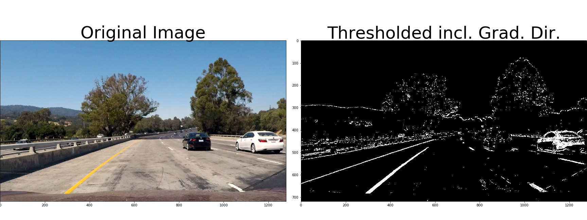
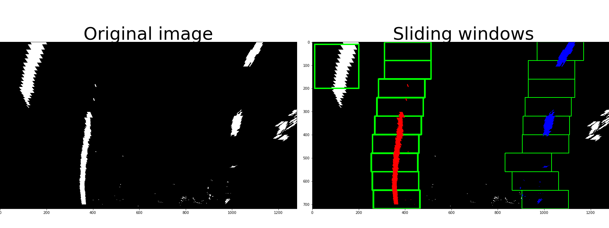

## Writeup for P4 Advanced Lane Finding

The project uses video and image analytical techniques to project find the lane where the car is driving, and to project that lane onto the camera image.

The goals / steps of this project are the following:  

1. Compute the camera calibration matrix and distortion coefficients given a set of chessboard images. 
1. Apply a distortion correction to raw images.
1. Use color transforms, gradients, etc., to create a thresholded binary image.
1. Apply a perspective transform to rectify binary image ("birds-eye view"). 
1. Detect lane pixels and fit to find the lane boundary.
1. Determine the curvature of the lane and vehicle position with respect to center.
1. Warp the detected lane boundaries back onto the original image.
1. Output visual display of the lane boundaries and numerical estimation of lane curvature and vehicle position. 

## Rubric Points 

### Camera Calibration 

#### 1. Have the camera matrix and distortion coefficients been computed correctly and checked on one of the calibration images as a test? 

The code for this step is contained in code cell #4 of the Jupyter notebook.
I start by preparing "object points", which will be the (x, y, z) coordinates of the chessboard corners in the world. Here I am assuming the chessboard is fixed on the (x, y) plane at z=0, such that the object points are the same for each calibration image. Thus, objp is just a replicated array of coordinates, and objpoints will be appended with a copy of it every time I successfully detect all chessboard corners in a test image. 
imgpoints will be appended with the (x, y) pixel position of each of the corners in the image plane with each successful chessboard detection. 
I then used the output objpoints and imgpoints to compute the camera calibration and distortion coefficients using the cv2.calibrateCamera() function. I applied this distortion correction to the test image using the cv2.undistort() function and obtained this result: 

### Pipeline (single images)
#### 2. Has a binary image been created using color transforms, gradients or other methods? 
I used different techniques shown in the lecture to produce a binary image highlighting the lane shown in code cell #7 and #8.

I create a pipeline to calculate the binary image. First I apply the Sobel operator both vertically and horizontally, using kernel size 7 for both directions and using the threshold between 10 and 255 horizontally and 60 and 255 vertically. I then use the Sobel operator to calculate the absolute value or gradient magnitude, using the kernel size 7 and the threshold 40 to 255. Thirdly I use the Sobel operator to calculate the direction of the gradient using the arctangent. Again I use the same kernel size, and set the threshold between 0.65 and 1.1. Lastly, I try to highlight the lane markers by converting the colormap to HLS and HSV, highlighting the saturation higher than 170 for HLS (most saturated) and the value (brightness) higher than 200. Then I combine all these gradients to create the binary image:

I then crop the image to a region of interest using a manual set of vertices, code cell #7 and #9. Resulting in a binary image like this:

#### 3. Has a perspective transform been applied to rectify the image? 
The function for my perspective transform is in cell #10. I experimented with the numbers using the image below in code cell #11 to align the lines:

I also verified the warp function using curved pictures:

#### 4. Have lane line pixels been identified in the rectified image and fit with a polynomial? 
Code cell 13 shows the histogram of the cropped binary image:

The histogram shows the left lane clearly. However, the histogram of the right lane separator also shows that noise can misled the identification of the lane separator.
I used the code from the lecture in cell #14 to first make sliding window plot in cell #15:

The code is using the histogram to find where the bottom part of the picture have the max number of white pixels in the left and right part, using that as a starting point for making windows along the trajectory.
Then a polyfit functions are used to create a continuous function of the lane separator.Here is the same picture with the polyfited curve plotted on top:

Once we know where the lines are, I can skip the lines and plot the margin indicating the search window:

#### 5. Having identified the lane lines, has the radius of curvature of the road been estimated? And the position of the vehicle with respect to center in the lane
Again, using the code from the lecture in code cell #19 to #20 to find the cure in pixel and real space. And in code cell #23 calculate the offset based on the asumptio0n that the camera is place in the middle front.

In code cells #25 to #28 I show how the projected lane are being superimposed on top of the image, using all the steps above in a pipeline, and showing the curve radius and the offset:

### Pipeline (video)
#### 1. Does the pipeline established with the test images work to process the video? 
I use the same pipeline in the video as for the singlre picture above.

The video is [here](output_images/project_video_projected.mp4).

### README 
#### 1. Has a README file been included that describes in detail the steps taken to construct the pipeline, techniques used, areas where improvements could be made? 
You're reading it! 

### Discussion 
I very much used the code from the lectures, and therefore was not completely stuck at any time. However, I had some problems with the light conditions on the road, and noise that created “false” lane separators.

I am not completely understand all the implications of the Sobel operator, even if I have used it in this project. 

When using my pipeline on the challenge [video](output_images/challenge_video_projected.mp4), the pipeline fails. I would need to analyse better, but I expect that is has to do with the light conditions, that the pipeline identify a change in the lighting as a lane separator. I did not use hough lines, nor any colour functions to identify “white” or “yellow”, this could made a difference in the challenge video.

The project was very enjoyable, I have not worked much with video images before, and I learned a lot.

